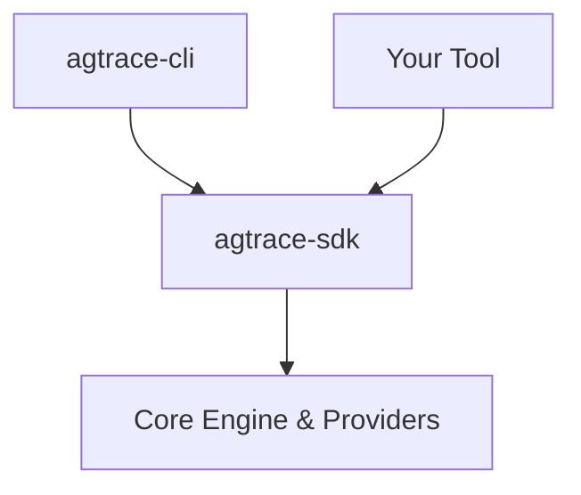

<div align="center">
  
  <h1>agtrace</h1>
  <p><strong>The Observability Platform for AI Agents.</strong></p>
  <p>Local-first OpenTelemetry for Claude, Codex, and Gemini.</p>

  [](https://www.npmjs.com/package/@lanegrid/agtrace)
  [](https://crates.io/crates/agtrace-sdk)
</div>

---


**agtrace** provides a unified timeline and analysis layer for fragmented AI agent logs.
Use the **CLI** for instant visualization, or build custom monitoring tools with the **SDK**.

## 🌟 Core Value

1. **Universal Normalization**: Converts diverse provider logs (Claude, Gemini, etc.) into a standard `AgentEvent` model.
2. **Schema-on-Read**: Resilient to provider updates. No database migrations needed.
3. **Local-First**: 100% offline. Privacy by design.
4. **Zero-Instrumentation**: Automatically detects and watches logs from standard locations (`~/.claude/projects`, `~/.codex/sessions`, `~/.gemini/tmp`). No code changes required.

## 🚀 Quick Start (CLI)

The reference implementation of the agtrace platform.

```bash
npm install -g @lanegrid/agtrace
cd my-project
agtrace init      # initialize workspace (XDG data directory)
agtrace watch     # live dashboard
```

## 🛠️ Building with the SDK

Embed agent observability into your own tools (vital-checkers, IDE plugins, dashboards).

```toml
[dependencies]
agtrace-sdk = "0.2"
```

```rust,no_run
use agtrace_sdk::{Client, Lens, types::SessionFilter};

let client = Client::connect_default().await?;
let sessions = client.sessions().list(SessionFilter::all())?;
if let Some(summary) = sessions.first() {
    let handle = client.sessions().get(&summary.id)?;
    let report = handle.analyze()?.through(Lens::Failures).report()?;
    println!("Health: {}/100", report.score);
}
```

**See also**: [SDK Documentation](https://docs.rs/agtrace-sdk) | [Examples](crates/agtrace-sdk/examples/) | [SDK README](crates/agtrace-sdk/README.md)

## 📚 Documentation

- [Why agtrace?](docs/motivation.md) - Understanding the problem and solution
- [Getting Started](docs/getting-started.md) - Detailed installation and usage guide
- [Architecture](docs/architecture.md) - Platform design and principles
- [SDK Documentation](crates/agtrace-sdk/README.md) - Building custom tools
- [Full Documentation](docs/README.md) - Commands, FAQs, and more

## 🔌 Supported Providers

- **Claude Code** (Anthropic)
- **Codex** (OpenAI)
- **Gemini** (Google)

## 📦 Architecture



- **Core SDK**: `agtrace-sdk`, `agtrace-engine`, `agtrace-providers`
- **Applications**: `agtrace-cli` (Reference Implementation)

## License

Dual-licensed under the MIT and Apache 2.0 licenses.
