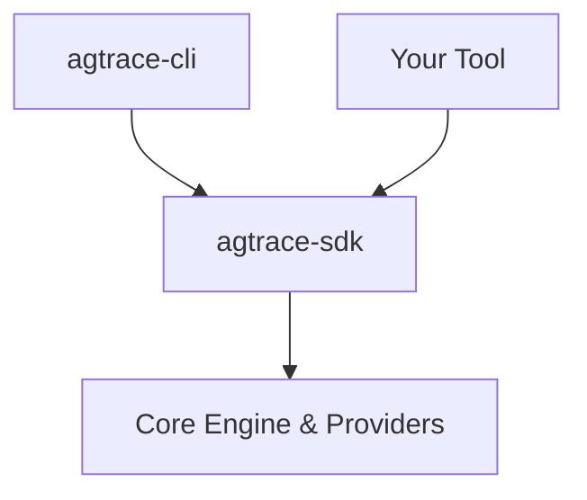

<div align="center">
  
  <h1>agtrace</h1>
  <p><strong>The Observability Platform for AI Agents.</strong></p>
  <p>Local-first OpenTelemetry for Claude, Codex, and Gemini.</p>

  [](https://www.npmjs.com/package/@lanegrid/agtrace)
  [](https://crates.io/crates/agtrace-sdk)
</div>

---


**agtrace** is an observability platform for AI agent execution traces.
Local-first, privacy-preserving, and zero-instrumentation.

## Two Ways to Use agtrace

### 1. 🔍 Live Monitoring with `watch`

Real-time TUI dashboard for agent sessions. Like `top` + `tail -f` for AI agents.

- **100% local and offline** — Privacy by design, no cloud dependencies
- **Auto-discovery** — Finds logs from Claude Code, Codex, and Gemini automatically
- **Zero instrumentation** — No code changes or configuration needed
- **Universal timeline** — Unified view across all providers

### 2. 🤖 Agent Self-Reflection via MCP

Connects to AI coding assistants via [Model Context Protocol](https://modelcontextprotocol.io), enabling agents to query their own execution history.

- **Query past sessions** — "Show me sessions with failures in the last hour"
- **Search across traces** — Find specific tool calls, events, or patterns
- **Analyze performance** — Detect loops, failures, and bottlenecks
- **Debug behavior** — Inspect reasoning chains and tool usage

**Supported MCP clients:** Claude Code, Codex (OpenAI), Claude Desktop
**Note:** Gemini CLI support is planned (requires Content-Length framing implementation)

## 🚀 Quick Start

```bash
npm install -g @lanegrid/agtrace
cd my-project
agtrace init      # Initialize workspace (one-time setup)
agtrace watch     # Launch live dashboard
```

## 🔌 MCP Integration

Enable agent self-reflection in your AI coding assistant:

**Claude Code:**
```bash
claude code mcp add agtrace -- agtrace mcp serve
```

**Codex (OpenAI):**
```bash
codex mcp add agtrace -- agtrace mcp serve
```

**Claude Desktop:**
Add to `~/Library/Application Support/Claude/claude_desktop_config.json`:
```json
{
  "mcpServers": {
    "agtrace": {
      "command": "agtrace",
      "args": ["mcp", "serve"]
    }
  }
}
```

**Example queries after setup:**
- *"Read previous sessions and help me understand why we made decision X"*
- *"Show sessions from the last hour with failures"*
- *"Search for tool calls that modified the database schema"*
- *"Analyze the most recent session for performance issues"*

**Real-world workflow:** An agent used `list_sessions` → `get_session_summary` → `get_session_turns` to retrieve 34KB of historical context, then generated a specification that respected past design constraints. 334K tokens processed with 85% cache efficiency.

For detailed setup and real examples, see the [MCP Integration Guide](docs/mcp-integration.md).

## 🛠️ Building with the SDK

Embed agent observability into your own tools (vital-checkers, IDE plugins, dashboards).

```toml
[dependencies]
agtrace-sdk = "0.4"
```

```rust,no_run
use agtrace_sdk::{Client, Lens, types::SessionFilter};

let client = Client::connect_default().await?;
let sessions = client.sessions().list(SessionFilter::all())?;
if let Some(summary) = sessions.first() {
    let handle = client.sessions().get(&summary.id)?;
    let report = handle.analyze()?.through(Lens::Failures).report()?;
    println!("Health: {}/100", report.score);
}
```

**See also**: [SDK Documentation](https://docs.rs/agtrace-sdk) | [Examples](crates/agtrace-sdk/examples/) | [SDK README](crates/agtrace-sdk/README.md)

## 📚 Documentation

- [Why agtrace?](docs/motivation.md) - Understanding the problem and solution
- [Getting Started](docs/getting-started.md) - Detailed installation and usage guide
- [Architecture](docs/architecture.md) - Platform design and principles
- [SDK Documentation](crates/agtrace-sdk/README.md) - Building custom tools
- [Full Documentation](docs/README.md) - Commands, FAQs, and more

## 🔌 Supported Providers

- **Claude Code** (Anthropic)
- **Codex** (OpenAI)
- **Gemini** (Google)

## 📦 Architecture



- **Core SDK**: `agtrace-sdk`, `agtrace-engine`, `agtrace-providers`
- **Applications**: `agtrace-cli` (Reference Implementation)

## License

Dual-licensed under the MIT and Apache 2.0 licenses.
