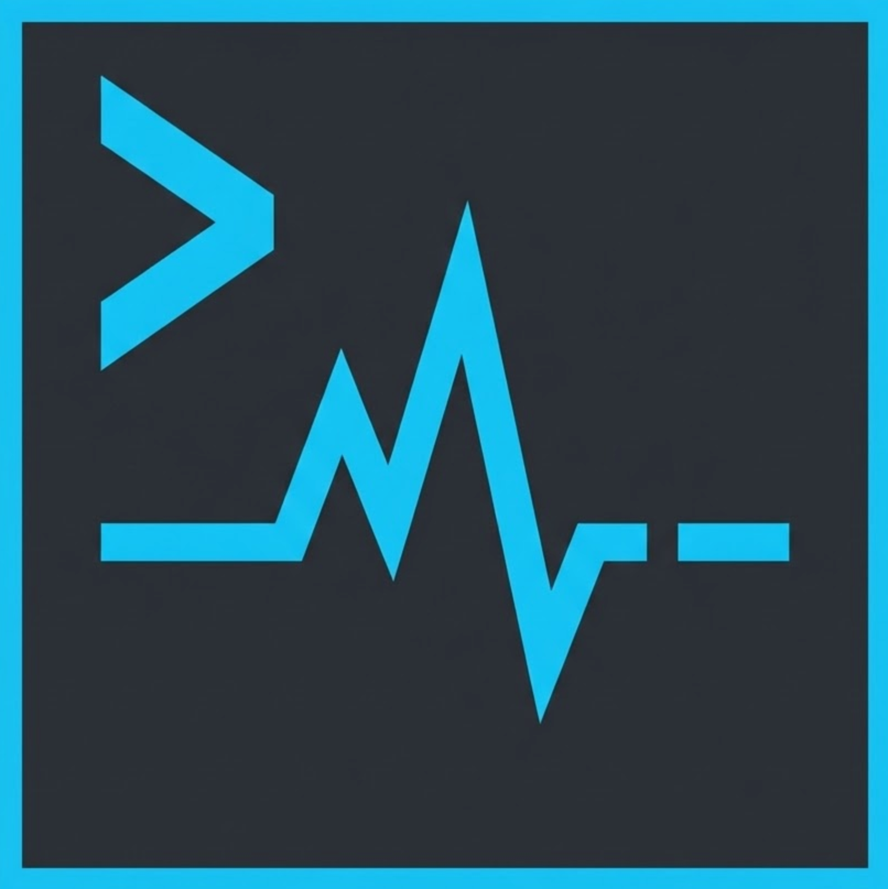
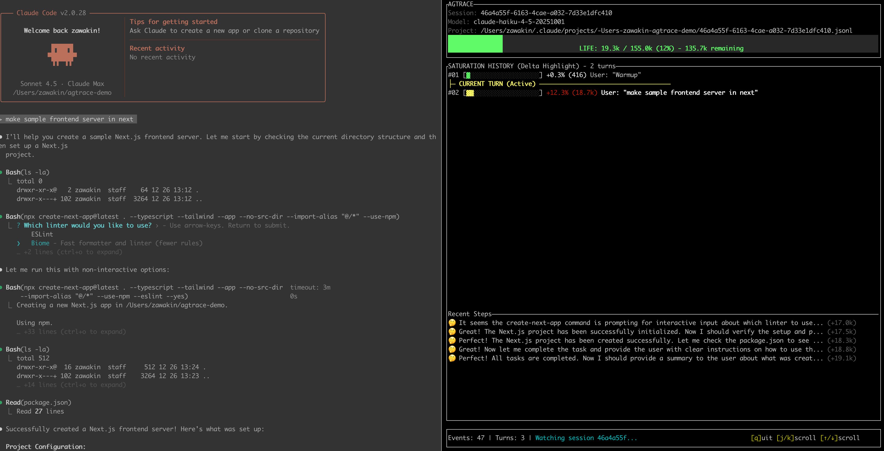

<div align="center">
  
  <h1>agtrace</h1>
  <p><strong>The Observability Layer for AI Coding Agents.</strong></p>
  <p>
    Real-time telemetry and session forensics for Claude Code, Codex, and Gemini.
    Track context window usage, compaction behavior, and regressions —
    <strong>locally</strong>, with <strong>zero overhead</strong>.
  </p>

  [](https://www.npmjs.com/package/@lanegrid/agtrace)
  [](https://crates.io/crates/agtrace)
</div>

---

## 📉 The Problem: No Observability for Context Compaction

Modern AI coding agents rely on context window compaction by design. This is expected behavior across Claude Code, Codex, and Gemini.

The problem is not that compaction happens.

The problem is that you cannot:
- observe *when* compaction occurs
- measure *how much* context was discarded
- correlate compaction with regressions, hallucinations, or sudden behavioral shifts

In practice, we are running a lossy, stateful system without logs, metrics, or traces for its most critical state transition.

## ⚡ The Solution: agtrace

**agtrace** adds the missing observability layer to AI coding agents.

By normalizing provider logs and exposing real-time context usage and compaction behavior, agtrace makes agent state transitions inspectable and debuggable — without sending sensitive data to the cloud.


*Live demo of `agtrace watch` — real-time session monitoring*



*The dashboard showing context usage, current turn, and token costs*

---

## ✨ Key Features

### 1) Live Telemetry (`watch`)
A TUI dashboard that visualizes the health of your active session:
- remaining context window (before compaction pressure)
- current turn and recent activity
- token/cost telemetry (where available)

### 2) Provider Normalization
Whether you use **Claude Code**, **Codex**, or **Gemini**, agtrace converts their events into a consistent internal format so you can reason about sessions the same way across providers.

### 3) Local-Only by Default
Agent logs often contain sensitive code and secrets. **agtrace runs 100% locally** and reads directly from local log files (e.g., `~/.claude`). No data is sent to the cloud.

### 4) Automatic Session Tracking
Keep `watch` running in a separate terminal pane. It automatically detects newly created sessions and follows along as you switch agents or start fresh conversations.

### 5) Session Forensics (“Lab”)
Investigate agent behavior across history:
- search across thousands of past sessions
- analyze tool usage patterns
- inspect raw provider events when debugging schema changes (`--raw`)

### 6) High-Performance, Minimal Footprint
Built in **Rust**, agtrace is designed to run continuously without slowing down your machine while you work with heavyweight AI agents.

### 7) Instant Log Analysis
Parse and grep through gigabytes of JSONL logs quickly. The schema-on-read approach plus Rust performance makes historical analysis fast and practical.

---

## 📦 Installation

For best performance and easy access to `watch`, install globally.

### via npm (Recommended)

```bash
npm install -g @lanegrid/agtrace
```

### via npx (no installation)

If you prefer not to install globally, run via `npx`.

*Note: In the examples below, replace `agtrace` with `npx @lanegrid/agtrace`.*

```bash
npx @lanegrid/agtrace@latest init
npx @lanegrid/agtrace@latest watch
```

### via Cargo (Rust)

```bash
cargo install agtrace
```

---

## 🚀 Quick Start

### 0) Try the Demo (Optional)

See `agtrace watch` in action without configuring logs:

```bash
agtrace demo
```

This simulates a live AI session to demonstrate the TUI dashboard. Use `--speed fast` for a quicker preview.

### 1) Initialize in Your Project

From your project directory:

```bash
cd /path/to/your/project

agtrace init
```

### 2) Start Your AI Coding Agent

In one terminal, launch your agent as usual:

```bash
# Example: Claude Code
claude

# Or Codex, Gemini, etc.
```

### 3) Watch in Another Terminal

In a separate terminal pane (same project directory):

```bash
agtrace watch
```

That’s it. No integration required — agtrace automatically detects and monitors your agent session.

**`watch` surfaces:**

* context window usage
* cost telemetry (where available)
* turns and recent activity
* automatic switching to newly created sessions

### 4) Analyze Past Sessions

List recent sessions across providers, or inspect a specific one:

```bash
# List recent sessions
agtrace session list

# Show analysis of a specific session (context usage, turns, models)
agtrace session show <session_id>
```

### 5) Advanced: The Lab

Debug agent interactions or search for specific patterns, e.g. “When did the agent try to write to `package.json`?”:

```bash
# Find all file write operations across history
agtrace lab grep "write_file" --json

# Inspect a raw provider event (useful for debugging schema changes)
agtrace lab grep "mcp" --raw --limit 1
```

---

## 🏗️ Architecture

agtrace is designed around **pointer-based indexing** and **schema-on-read**:

1. **No Data Duplication**
   agtrace does not copy your massive log files. It indexes metadata and points to the original logs.

2. **Resilient to Schema Drift**
   Provider log schemas change frequently. agtrace parses logs at read time, so schema updates are less likely to corrupt or invalidate historical indexes.

3. **Project Isolation**
   Sessions are grouped by a project root hash to keep workspaces clean and prevent cross-project mixing.

---

## 🤝 Supported Providers

* **Claude Code** (Anthropic)
* **Codex** (OpenAI)
* **Gemini** (Google)

---

## 📜 License

Dual-licensed under the MIT and Apache 2.0 licenses.
